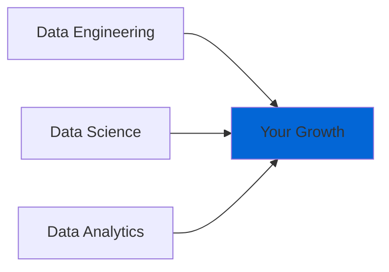

# Datagent

Transforming startups through enterprise-grade data solutions. From infrastructure to insights, we deliver scalable data excellence.

## Our Expertise



### Engineering
- Data Infrastructure
- ETL Pipelines
- Real-time Processing
- Database Optimization

### Science
- Machine Learning
- Predictive Analytics
- NLP & Computer Vision
- Deep Learning

### Analytics
- Business Intelligence
- KPI Dashboards
- Performance Metrics
- Strategic Insights

## Our Impact

- 📈 35% cost reduction in inventory management
- 🚀 60% improved data processing efficiency
- 💡 45% increase in marketing ROI
- 🛡️ $2M saved through fraud prevention

## Technology

We leverage industry-leading tools and frameworks:

```plaintext
Engineering     Science         Analytics       Cloud
────────────    ────────────   ────────────    ────────────
Apache Spark    TensorFlow     Tableau         AWS
PostgreSQL      PyTorch        Power BI        GCP
MongoDB         scikit-learn   Looker          Azure
Kafka           Hugging Face   Grafana         Snowflake
```

## Team

Expert professionals dedicated to your success:
- Data Engineers
- Data Scientists
- Data Analysts
- Solutions Architects
- Security Specialists

## Security & Compliance

Enterprise-grade security with GDPR, CCPA, and HIPAA compliance built into every solution.

## Connect

[Website](#) • [LinkedIn](#) • [Twitter](#) • [Contact](#)

---
© 2024 Datagent. All rights reserved.
